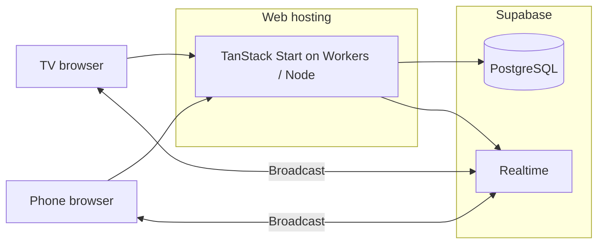

# Deployment Guide — ABYSSAL (Sonar Deep Dives)

This document describes how to deploy the application for production and booth events, which services to use, and what to configure before going live.

**First time?** Complete local setup and Supabase configuration in **[Setup.md](./Setup.md)** (prerequisites, dependencies, migrations, `.env`) before deploying.

---

## 0. Prerequisites (summary)

| Item | Required for deploy |
|------|---------------------|
| Supabase project with **all migrations** applied | Yes |
| `VITE_SUPABASE_URL` + `VITE_SUPABASE_PUBLISHABLE_KEY` on host | Yes |
| `SUPABASE_SERVICE_ROLE_KEY` on host (server secret) | Yes |
| At least one **admin** Auth user | Yes |
| Realtime **Allow public access** disabled | Yes |
| Production build (`bun run build`) succeeds | Yes |
| HTTPS + WebSocket access at venue | Yes (events) |

Details: [Setup.md](./Setup.md) · Env template: [`.env.example`](../.env.example)

---

## 1. What you are deploying

The system has two deployable parts:

| Component | Role | Typical host |
|-----------|------|----------------|
| **Web app** | TanStack Start (SSR + server functions), React UI, Canvas game | Edge / Node host |
| **Supabase project** | PostgreSQL, Auth keys, Realtime, RLS | Supabase Cloud (or self-hosted) |

Visitors only need HTTPS access to the web app and Supabase (WebSocket for Realtime). No separate game server is required.



---

## 2. Recommended stack (best fit for this repo)

This project is generated for **Lovable** and **Cloudflare Workers** (`wrangler.jsonc`, `@lovable.dev/vite-tanstack-config`, `@cloudflare/vite-plugin`). The lowest-friction path:

| Layer | Provider | Why |
|-------|----------|-----|
| **App hosting** | [Lovable Cloud](https://lovable.dev) | Native integration; publish from the Lovable editor; matches current production URL pattern (`*.lovable.app`) |
| **Database + Realtime** | [Supabase](https://supabase.com) | Already used for sessions, scores, config, registrations, Broadcast |
| **Stack choice** | See [Stack-Comparison-Supabase-vs-Cloudflare.md](./Stack-Comparison-Supabase-vs-Cloudflare.md) | Supabase vs full Cloudflare (features, price, migration effort) |
| **CI/CD** | [Deploy-Cloudflare-Workers-Builds.md](./Deploy-Cloudflare-Workers-Builds.md) | GitHub Actions vs Cloudflare Workers Builds |
| **Analytics (optional)** | [Umami](https://umami.is) (self-hosted or cloud) | Configured via admin panel (`umami_script_url`, `umami_website_id`) |
| **DNS / CDN** | Cloudflare (via Lovable or your own zone) | TLS, caching, DDoS protection when using custom domain |

### 2.1 Lovable Cloud (recommended for teams using Lovable)

1. Connect the GitHub repo in Lovable (if not already).
2. Set **environment variables** in Lovable project settings (see [§4](#4-environment-variables)).
3. Run **Share → Publish** (or equivalent deploy action) from the Lovable dashboard.
4. Attach a **custom domain** in Lovable/Cloudflare if needed for booth branding (e.g. `game.yourcompany.com`).

**Pros:** No Wrangler/CI setup; SSR and server functions work with the bundled config.  
**Cons:** Tied to Lovable workflow; less control than raw Cloudflare dashboard.

### 2.2 Supabase (required)

1. Create a project at [supabase.com](https://supabase.com) (or use the project linked from Lovable).
2. Apply migrations:

   ```bash
   supabase link --project-ref <your-project-ref>
   supabase db push
   ```

   Migrations live in `supabase/migrations/`. Apply all of them before first production deploy.

3. Configure **Realtime** (Project → Realtime → Settings):
   - Disable **“Allow public access”** after migration `20260515120300_realtime_authorization.sql` (Broadcast uses private channels + RLS).
4. Copy **Project URL** and **anon/publishable key** for the client.
5. Copy **service_role key** for server-only admin operations — never expose as `VITE_*`.

**Region:** Choose a region close to your event (e.g. EU for European trade shows) to reduce latency for Realtime and DB.

---

## 3. Alternative app hosting providers

The app builds with `bun run build` (Vite). TanStack Start on Cloudflare uses `wrangler.jsonc`. Other hosts are possible with varying effort.

| Provider | Fit | Notes |
|----------|-----|--------|
| **Cloudflare Workers** | Excellent | First-class via `wrangler.jsonc` and `@cloudflare/vite-plugin`. Deploy with Wrangler CLI or Workers Builds. Set secrets in dashboard or `wrangler secret put`. |
| **Lovable Cloud** | Excellent | Easiest if the project was created in Lovable. |
| **Vercel** | Good | Supports many Vite/React SSR stacks; may need adapter config not present in repo today — verify TanStack Start + Vercel compatibility for your version. |
| **Netlify** | Good | Similar to Vercel; edge functions for server routes. |
| **Railway / Render / Fly.io** | Good | Run as Node server if you add a Node deployment target to TanStack Start; more ops, full control. |
| **AWS (Amplify, ECS, Lambda)** | Fair | Enterprise; more setup for SSR + secrets management. |
| **Azure Static Web Apps + Functions** | Fair | Possible for static + API split; SSR path is non-trivial. |
| **Self-hosted (Docker + nginx)** | Fair | Build locally, serve `dist`/Vinxi output behind reverse proxy; you manage TLS, scaling, and Node runtime. |

### 3.1 Cloudflare Workers (manual deploy)

**Full walkthrough (steps, domain, cost estimates):** [Cloudflare-Deploy.md](./Cloudflare-Deploy.md)

For teams not using Lovable’s publish button:

```bash
bun install
bun run build
npx wrangler deploy
```

Set secrets (production):

```bash
npx wrangler secret put SUPABASE_SERVICE_ROLE_KEY
npx wrangler secret put SUPABASE_URL
npx wrangler secret put SUPABASE_PUBLISHABLE_KEY
```

Public client variables are typically injected at build time via `VITE_*` (see below).

### 3.2 Provider we do **not** recommend for this app

| Provider | Reason |
|----------|--------|
| **GitHub Pages / pure static S3** | TanStack Start needs SSR and server functions for admin auth and `fetchGameConfig`; static-only hosting breaks `/admin` saves and loaders. |
| **Shared cheap PHP hosting** | No Node/Workers runtime for this stack. |

---

## 4. Environment variables

### 4.1 Client-safe (build / runtime — may use `VITE_` prefix)

| Variable | Required | Description |
|----------|----------|-------------|
| `VITE_SUPABASE_URL` | Yes | Supabase project URL, e.g. `https://xxxx.supabase.co` |
| `VITE_SUPABASE_PUBLISHABLE_KEY` | Yes | Anon / publishable key (RLS applies) |
| `VITE_APP_ORIGIN` | Recommended (production) | Public HTTPS origin for **controller QR links**, `og:url`, and SEO — e.g. `https://game.yourcompany.com` or your Workers URL. Set at **build time**. |
| `VITE_OG_IMAGE_URL` | Optional | Absolute URL for default Open Graph / Twitter card image |

Also readable as `SUPABASE_URL` / `SUPABASE_PUBLISHABLE_KEY` in some server paths.

### 4.2 Server-only (never prefix with `VITE_`)

| Variable | Required | Description |
|----------|----------|-------------|
| `SUPABASE_SERVICE_ROLE_KEY` | Yes (production) | Admin writes, **booth session/score persistence** (validated server functions), registration export |
| `ADMIN_BOOTSTRAP_EMAILS` | Optional | Comma-separated operator emails auto-added to `admin_users` on first sign-in |

Set these only in the hosting secret store (Lovable env, Wrangler secrets, Vercel env, etc.).

### 4.3 Example `.env` file

Copy [`.env.example`](../.env.example) to `.env` for local development. Use the same variable names in your hosting provider’s secret store for production (never commit real keys).

---

## Admin operators

Admin access uses **Supabase Auth** (email + password), not a shared PIN.

1. In **Supabase Dashboard → Authentication → Users**, create an operator account (or invite by email).
2. Grant admin access using **one** of:
   - **Bootstrap env:** set `ADMIN_BOOTSTRAP_EMAILS=ops@yourcompany.com` on the host; the email is added to `admin_users` on first successful sign-in.
   - **JWT metadata:** edit the user → App Metadata → `{ "role": "admin" }`.
   - **Database:** after the user exists, run in SQL editor:
     ```sql
     INSERT INTO public.admin_users (user_id, email)
     SELECT id, email FROM auth.users WHERE email = 'ops@yourcompany.com';
     ```
3. In **Authentication → Providers**, ensure **Email** is enabled. Disable public sign-up if only pre-provisioned operators should have accounts.

Server functions require a valid session JWT (`attachSupabaseAuth` + `requireAdminAuth`). Mutations still use `SUPABASE_SERVICE_ROLE_KEY` on the server.

---

## 5. Deployment checklist

For a **full go-live validation** (solution review, smoke tests, known gaps, booth day), use **[Production-Checklist.md](./Production-Checklist.md)**.

### 5.1 Before first deploy

- [ ] Supabase project created and migrations applied (`supabase db push`)
- [ ] `game_config` seed row exists (created by initial migration)
- [ ] Realtime: **Allow public access** disabled (see [issues.md](./issues.md) fix #5)
- [ ] `SUPABASE_SERVICE_ROLE_KEY` set on host
- [ ] At least one admin user in Supabase Auth (see [Admin operators](#admin-operators))
- [ ] `VITE_SUPABASE_*` and `VITE_APP_ORIGIN` set for production build
- [ ] Production build succeeds: `bun run build`
- [ ] Custom domain DNS points to host (optional)

### 5.2 Before each event

- [ ] Open `/admin`, sign in as operator, test branding save
- [ ] Open `/` on TV at the **same host** as `VITE_APP_ORIGIN` (or set `VITE_APP_ORIGIN` before build)
- [ ] Test phone scan → registration (name, company, work email, GDPR) → one full game
- [ ] Confirm scores appear on `/scoreboard`
- [ ] Venue Wi-Fi allows WebSockets to `*.supabase.co` (Realtime)
- [ ] Disable public sign-up in Supabase Auth if not needed

### 5.3 After event (optional)

- [ ] Export registrations via `fetchPlayerRegistrations` (admin server function) if needed for marketing
- [ ] Archive or purge old scores/sessions from admin if desired

---

## 6. Custom domain and HTTPS

- **Requirement:** HTTPS everywhere (QR codes, secure cookies, WebSocket).
- **Lovable / Cloudflare:** Add domain in project settings; validate DNS (CNAME).
- **Booth tip:** Use a short, memorable hostname printed near the QR code.

Controller QR URLs use `getAppOrigin()` (`src/lib/appUrl.ts`): **`VITE_APP_ORIGIN` when set**, otherwise `window.location.origin` on the TV. Set `VITE_APP_ORIGIN` to your canonical HTTPS host before `build` / deploy so phones always get a trusted URL (custom domain recommended over raw `*.workers.dev` for booth Wi‑Fi). The QR also includes a secret **`token`** query param; do not share controller links manually.

---

## 7. CI/CD (optional)

| Approach | When to use |
|----------|-------------|
| **Lovable publish** | Simplest; no pipeline |
| **GitHub Actions + Wrangler** | [`.github/workflows/deploy-cloudflare.yml`](../.github/workflows/deploy-cloudflare.yml) — see [Cloudflare-Deploy.md §6](./Cloudflare-Deploy.md#phase-6--cicd-github-actions) |
| **GitHub Actions + Supabase CLI** | [`.github/workflows/supabase-migrate.yml`](../.github/workflows/supabase-migrate.yml) |

Migration automation is configured in [`.github/workflows/supabase-migrate.yml`](../.github/workflows/supabase-migrate.yml). Required secrets: `SUPABASE_ACCESS_TOKEN`, `SUPABASE_PROJECT_REF`, `SUPABASE_DB_PASSWORD`.

---

## 8. Sizing and cost (rough guidance)

| Service | Booth-scale traffic | Notes |
|---------|---------------------|--------|
| **Supabase Free / Pro** | Free tier often enough for single-event | Watch Realtime concurrent connections and DB size; Pro for multiple simultaneous booths |
| **Cloudflare Workers** | Free tier generous for static+SSR | Paid plan if traffic spikes |
| **Lovable** | Per platform plan | Includes hosting |
| **Umami** | Self-hosted or cloud | Optional analytics |

For **multiple TVs at one event**, each TV opens one Realtime channel; each player adds one connection. Plan ~2 connections per active player + TV pair.

---

## 9. Monitoring

| What | How |
|------|-----|
| App errors | Host logs (Cloudflare Workers tail, Lovable logs) |
| DB / API | Supabase Dashboard → Logs, API metrics |
| Realtime | Supabase → Realtime inspector |
| Usage analytics | Umami (if configured in admin) |

---

## 10. Troubleshooting

| Symptom | Likely cause | Fix |
|---------|----------------|-------|
| Admin save fails | Missing `SUPABASE_SERVICE_ROLE_KEY` | Set server secret; redeploy |
| Controller cannot connect | Realtime blocked or public access mismatch | Check venue firewall; Realtime settings + `private: true` channels |
| QR opens wrong site | TV on staging URL | Open production URL on TV |
| Blank page after deploy | Build env missing `VITE_SUPABASE_*` | Rebuild with vars set |
| No scores on leaderboard | Missing service role or validation rejected | Ensure `SUPABASE_SERVICE_ROLE_KEY` on host; complete a full dive (≥8s); check server logs for `submitGameScore` |

---

## 11. Related documentation

- [Solution Design](./solution-design.md) — architecture and ops runbook  
- [Security Issues](./issues.md) — RLS and Realtime hardening  
- [Product README](../README.md) — gameplay and booth usage  

---

## 12. Quick reference — suggested providers summary

| Need | Suggested provider | Alternative |
|------|------------------|-------------|
| Host app (default) | **Lovable Cloud** | Cloudflare Workers |
| Database + Realtime | **Supabase** | Self-hosted Supabase |
| DNS / TLS | **Cloudflare** | Your registrar’s DNS |
| Analytics | **Umami** (optional) | Plausible, GA4 |
| Source control | **GitHub** | GitLab, Bitbucket |
| CI/CD | Lovable publish | GitHub Actions + Wrangler |

For most teams building on this repository: **deploy the app with Lovable or Cloudflare Workers, run the database on Supabase, apply migrations, set secrets, disable Realtime public access, then verify at the booth with one TV and one phone.**
