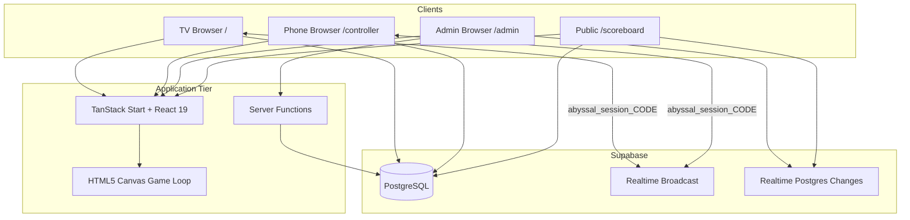
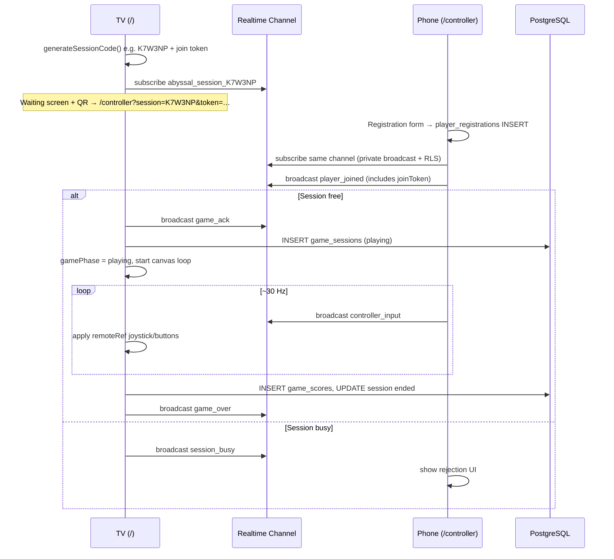
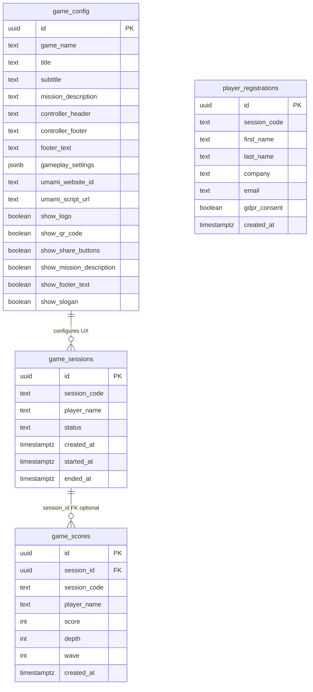

# Solution Design — ABYSSAL (Sonar Deep Dives)

## 1. Purpose and scope

### 1.1 Business goal

Drive booth engagement at conferences and trade shows by offering a short, shareable submarine mini-game. A large screen attracts attention; phones act as controllers so visitors participate without installing an app.

### 1.2 In scope

- TV/display game host (`/`)
- Phone remote controller (`/controller?session=XXX`)
- Public leaderboard (`/scoreboard`)
- Supabase Auth–gated admin console (`/admin`)
- Session isolation via **6-character** codes plus per-lobby **join tokens** in the QR URL
- Persistent scores, sessions, branding, and gameplay tuning in Supabase
- Player registration (first/last name, company, work email, GDPR consent; in-game label derived from first name)

### 1.3 Out of scope

- Player accounts or OAuth for visitors
- Anti-cheat beyond client-side checks and DB constraints
- Native mobile apps
- Dedicated game server (simulation runs in the TV browser)

---

## 2. System context



| Actor | Role |
|-------|------|
| Booth operator | Runs TV, configures branding via admin, monitors sessions |
| Visitor | Scans QR, registers, plays once per “engage” cycle (up to 3 rounds per registration flow on controller) |
| Anonymous public | Views global scoreboard |

---

## 3. Technology stack

| Layer | Choice | Notes |
|-------|--------|-------|
| UI framework | React 19 | Functional components, hooks |
| Routing / SSR | TanStack Start + TanStack Router | File-based routes under `src/routes/` |
| Styling | Tailwind CSS v4 | `src/styles.css`, Radix + shadcn-style `src/components/ui/` |
| Build | Vite 7 + `@lovable.dev/vite-tanstack-config` | Cloudflare Workers deployment via Wrangler |
| Backend data | Supabase (PostgreSQL + Realtime) | Anon/publishable key on client; service role intended for admin writes |
| Game rendering | HTML5 Canvas 2D | Monolithic `SubmarineGame.tsx` (~1.4k lines) + `game/drawUtils.ts`, `game/ambientVFX.ts` |
| Analytics | Umami (optional) | Script URL + website ID from `game_config`, injected in `__root.tsx` |
| Package manager | Bun | `bun.lockb`, `bunfig.toml` |

### 3.1 Deployment topology

- **Production target:** Lovable Cloud / Cloudflare Workers (`wrangler.jsonc` → `@tanstack/react-start/server-entry`)
- **Environment variables (typical):**
  - `VITE_SUPABASE_URL`, `VITE_SUPABASE_PUBLISHABLE_KEY` — client and SSR loaders
  - `SUPABASE_SERVICE_ROLE_KEY` — server-only admin mutations (required for secure config writes if public UPDATE is removed)
  - `ADMIN_BOOTSTRAP_EMAILS` — optional comma-separated emails auto-added to `admin_users` on first sign-in

---

## 4. Application structure

```
src/
├── routes/                 # TanStack file routes
│   ├── __root.tsx          # Shell, Umami, global footer
│   ├── index.tsx           # TV game → SubmarineGame
│   ├── controller.tsx      # Phone controller
│   ├── admin.tsx           # Admin panel
│   └── scoreboard.tsx      # Public leaderboard
├── components/
│   ├── SubmarineGame.tsx   # Game engine + TV session host
│   ├── RemoteController.tsx
│   ├── AdminPanel.tsx
│   ├── QRCodeDisplay.tsx
│   └── ui/                 # Shared design system
├── lib/
│   ├── gameChannel.ts      # Realtime broadcast protocol
│   ├── gameConfig.functions.ts  # SSR fetchGameConfig
│   ├── admin.server.ts     # Service-role DB helpers
│   ├── adminServer.ts      # Auth-gated server functions (JWT + admin_users)
│   ├── appUrl.ts           # VITE_APP_ORIGIN → QR / og:url
│   └── seo.ts
├── hooks/
│   └── useGameConfig.ts    # Client config fetch
└── integrations/supabase/
    ├── client.ts           # Browser/SSR anon client
    ├── types.ts            # Generated Database types
    └── auth-*.ts           # Middleware hooks (Lovable scaffold)
```

### 4.1 Routes

| Path | Component | Loader / SSR |
|------|-----------|--------------|
| `/` | `SubmarineGame` | `fetchGameConfig` for SEO head |
| `/controller` | `RemoteController` | Search params `session` (6 chars) + `token` (32-char hex join token) |
| `/admin` | `AdminPanel` | Config for head metadata |
| `/scoreboard` | Sortable table | Config for head metadata |

---

## 5. Core runtime flows

### 5.1 Session lifecycle (TV + phone)



**Session code generation** (`src/lib/gameChannel.ts`): **6** characters from `ABCDEFGHJKLMNPQRSTUVWXYZ23456789` (excludes ambiguous `0/O`, `1/I`). A **join token** (32 hex chars) is embedded in the QR and rotated when the TV returns to the waiting lobby.

**Controller URL:** Built with `buildControllerUrl(origin, sessionCode, joinToken)`. Origin is `getAppOrigin(window.location.origin)` so `VITE_APP_ORIGIN` can force the public HTTPS host when the TV is opened on a different hostname.

**Single-player rule:** The TV validates `joinToken` on join/input and rejects additional players with `session_busy`.

### 5.2 Realtime message protocol

Channel name: `abyssal_session_{CODE}` (uppercase). Event: `game`. Payload discriminated by `type`:

| Type | Direction | Purpose |
|------|-----------|---------|
| `player_joined` | Phone → TV | Start game; includes `playerName` |
| `controller_input` | Phone → TV | `joystickX/Y`, `thrust`, `fire`, `sonar`, `restart`, `playerName` |
| `game_ack` | TV → Phone | Join accepted |
| `session_busy` | TV → Phone | Join rejected |
| `game_over` | TV → Phone | Final `score`, `depth`, `wave` |
| `player_left` | Phone → TV | Controller disconnected; TV returns to waiting (with name guard) |

Broadcast config uses `self: false` so senders do not receive their own messages.

**Design choice:** Input uses **Realtime Broadcast only** — no per-frame database writes. This keeps latency low and cost predictable for event traffic.

### 5.3 Scoring and persistence

On game over (`SubmarineGame.tsx`):

1. **Local:** Top 10 scores in `localStorage` key `abyssal_scoreboard` (TV HUD).
2. **Remote:** `game_scores.insert` with session code, player name, score, depth, wave.
3. **Session:** `game_sessions.update` sets `status = ended`, `ended_at` where `status = playing`.

Check constraints (migration `20260412131852`): score 0–9_999_999, wave 1–100, depth 0–99_999, player name length 1–50.

### 5.4 Player registration (GDPR)

Before controlling, the phone collects (responsive form on `/controller`):

- First name / last name
- Company (1–120 chars)
- Work email (regex validated client + RLS `WITH CHECK`; hint shown for winner notifications)
- GDPR consent checkbox

The in-game / TV label is derived client-side from the first name (`derivePlayerDisplayName()` in `src/lib/playerRegistration.ts`, max 20 chars) and is not stored in `player_registrations`.

Data stored in `player_registrations` (migration `20260517120000` adds `company`). **No SELECT policy** — anonymous clients cannot read PII; only INSERT is allowed. Operators export via `fetchPlayerRegistrations` (service role).

### 5.5 Admin operations

| Action | Path | Mechanism |
|--------|------|-----------|
| Sign-in | UI | Supabase Auth email + password; `requireAdminAuth` on server functions |
| Branding / toggles / gameplay / Umami | UI | `updateGameConfig` → `updateConfigInDb` (service role) |
| Reset sessions / scores | UI | `resetSessions` / `resetScores` → service role |
| List / export registrations | Admin → Leads | `fetchPlayerRegistrations` → service role; CSV/JSON export |
| Live session/score list | UI | Server functions + Realtime where configured |

Allowed update fields are allowlisted in `adminServer.ts` input validator.

### 5.6 Configuration loading

Dual path:

1. **SSR / SEO:** `fetchGameConfig` server function reads `game_config` once per route loader.
2. **Client hydration:** `useGameConfig` hook fetches the same row on mount.

Gameplay constants in `SubmarineGame` merge **hardcoded defaults** with `gameplay_settings` JSONB from config (`DEFAULT_GAMEPLAY_SETTINGS` in `useGameConfig.ts`).

---

## 6. Game engine (high level)

### 6.1 State model

Central mutable `GameState` in a ref, updated each frame:

- Submarine: position, velocity, angle, HP, battery, cooldowns
- Entities: torpedoes, obstacles (mine, manta, swarm, shipwreck, beacon, seafloor), particles
- Meta: score, depth, wave, lives, spawn timers, sonar beam, VFX

### 6.2 Input merging

Priority for movement/combat:

1. Remote controller (`remoteRef`) when `gamePhase === playing`
2. Keyboard (`WASD`, arrows, space, `E`, `F`)
3. On-screen touch joystick + buttons (direct play on mobile/tablet)

### 6.3 Visibility / sonar

Enemies are mostly hidden (`visibility ~ 0.06`). Sonar ping expands FOV and range over time (`SonarBeam` with expand/hold/fade phases). Close-range “headlight” cone provides limited vision without sonar.

### 6.4 Direct play vs. remote play

The same `SubmarineGame` component supports booth mode (waiting + QR) and standalone keyboard/touch play without a connected phone.

---

## 7. Data model

### 7.1 Entity relationship



### 7.2 Row Level Security summary

| Table | SELECT | INSERT | UPDATE | DELETE |
|-------|--------|--------|--------|--------|
| `game_config` | Public | Public | Public* | — |
| `game_sessions` | Public | Public | Public | Public* |
| `game_scores` | Public | Public | — | Public* |
| `player_registrations` | Denied (no policy) | Public (validated) | — | — |

\*Documented as security risks in [issues.md](./issues.md). Production should restrict writes/deletes to service role or authenticated admin role.

### 7.3 Realtime publications

Admin and scoreboard subscribe to `postgres_changes` on `game_sessions` and `game_scores`. Game input does **not** use Postgres realtime — only Broadcast channels.

---

## 8. Security model (as designed vs. as implemented)

### 8.1 Intended model

| Surface | Trust level |
|---------|-------------|
| Visitors | Untrusted; may insert scores/sessions/registrations only |
| Admin | Supabase Auth + `admin_users` allowlist + server functions + service role |
| Config | Public read; admin-only write |

### 8.2 Current gaps

See [issues.md](./issues.md) and [improvement-report.md](./improvement-report.md). Notable items:

- Public `DELETE` on sessions/scores
- Public `UPDATE` on `game_config` (allows tampering with Umami URLs and gameplay JSON)
- Admin server falls back to anon key if service role missing
- Broadcast channels are not authorized — anyone who knows a session code can send inputs
- Legacy docs may reference a shared admin PIN — removed; use Supabase Auth operators

---

## 9. Observability and analytics

- **Umami:** Optional third-party script loaded from config (`__root.tsx`). Misconfiguration or malicious `umami_script_url` is a supply-chain risk if config UPDATE stays public.
- **No structured app logging** in the game loop; failures on score insert use fire-and-forget `.then(() => {})`.
- **Supabase dashboard** for DB and Realtime metrics during events.

---

## 10. Operational runbook (events)

1. Deploy or open production URL on TV (fullscreen browser).
2. Confirm `game_config` row exists and branding is correct (sign in at `/admin`).
3. TV shows QR linking to `/controller?session={CODE}&token={JOIN_TOKEN}` on the **canonical production host** (`VITE_APP_ORIGIN` if set).
4. Visitor registers on phone → ENGAGE → plays.
5. Monitor **Sessions** and **Scores** tabs; public leaderboard at `/scoreboard`.
6. For multiple booths: each TV instance generates its own session code — no coordination required.

### 10.1 Failure modes

| Symptom | Likely cause |
|---------|----------------|
| Admin save fails “check database permissions” | Service role missing; RLS blocks anon UPDATE |
| Phone stuck “session busy” | Prior player didn’t send `player_left`; refresh TV |
| Scores missing on leaderboard | Insert failed silently; check Supabase logs / RLS |
| Controller not moving sub | Wrong session code, Realtime disconnect, or TV not in `playing` |

---

## 11. Build and local development

```bash
bun install
bun run dev      # Vite dev server (Lovable config sets port/host)
bun run build    # Production bundle
bun run lint     # ESLint 9
```

Supabase: apply migrations from `supabase/migrations/` to the linked project. Regenerate `src/integrations/supabase/types.ts` after schema changes.

---

## 12. Extension points

| Change | Touch points |
|--------|----------------|
| New enemy type | `spawnObstacle`, `drawUtils`, `gameplay_settings` weights/HP |
| New admin field | Migration on `game_config`, `GameConfig` type, `adminServer` allowlist, `AdminPanel` UI |
| Auth for admin | ✅ Supabase Auth + `admin_users`; see [Deployment.md](./Deployment.md#admin-operators) |
| Public app URL / QR host | `VITE_APP_ORIGIN` in `src/lib/appUrl.ts` |
| Session code length | `SESSION_CODE_LENGTH`, Realtime policies in `20260515120500` |
| Split game engine | Extract `update()` / `render()` from `SubmarineGame.tsx` into `src/game/` modules |

---

## 13. Related documents

- [Improvement Report](./improvement-report.md)
- [Security Issues Snapshot](./issues.md)
- [Product README](../README.md)
